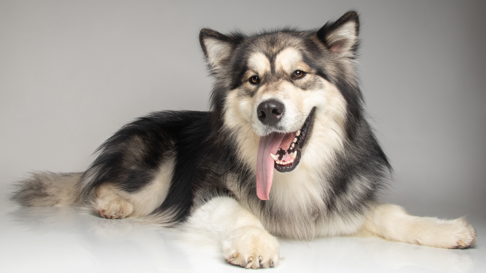

# My background

Things I've done in the past 15 years
1. Been a Java developer for 15 years primarily working on the architecture, design, deployments and support of large enterprise systems. 
2. Worked on really large integration projects (20 environments with a single environment having 20, 50 or 200 VM). 
3. Led a development team (~20 people) and a QA team (~60 people). 
4. Gone from doubting to loving TDD/BDD and supporting other developers and testers in adopting it. 

# Why I've made this site

I like to continually improve and as my dev team ran more tests and increased the pace of delivery, the QA team's traditional role in the process became a bottleneck.
During that time I found that QA took weeks to months to complete their test execution phase and in most cases didn't think Continuous Delivery or DevOps applied to them.
Even if you implement a lot of test automation to be run after coding everything, that's still automated inspection which doesn't ensure quality.

When I went looking for information, I never found information about how anyone got their traditional QA teams to change. 
There's information on how to use Cucumber to automate your tests but not how you get a large QA team to do so with legacy technology like COBOL or unpopular stuff like PL/SQL or how to have the tests run earlier without adding more resources or delays. 

Eventually when the opportunity presented itself, I decided to lead a large QA team to figure out how to help them evolve and it went very well.
That one QA team initially had 4 QA teams of almost 50-60 individuals with teams in Canada, India and the Philippines.

Looking back at my career, though I first started with automating deployments, in hindsight I should have started with changing the way we did testing.
I'd say it's for similar reasons as described in [this episode of Software Delivery in Small Batches][1]. 
Just as TDD is skill zero, helping the QA teams evolve should be one of the first priorities so that you have a system of shorter feedback loops.

So if you've read some of the [books that I've read or listened to the podcasts][2] and you're interested in reading about examples of how they were applied when leading a QA team down this path then perhaps this helps you.

# How I'm trying to share the knowledge

While helping the QA team learn, I found that instead of giving cold hard facts and principles, they understood better with stories they could relate too.
In this site, I'm attempting to explain some principles that I applied to those teams by recounting some of my experiences.
Over the past two years I've put as much of my knowledge that I've accumulated so far using models for coding/testing in these repos as examples that I'll reference in the stories.

I also tried to use analogies. 
1. I like gardening and I found managing a team like tending to a garden; you can't force the flowers to do what you want, but you can affect the environment to create the conditions for a garden that reaches its full potential.
2. Wood working is another one I use. I think TDD is like using a jig to make things. You have tools to make furniture but you also need jigs to help guide you so that you can use those tools effectively.

Hopefully this makes it easier for someone else who's interested in doing similar things.

# Why Sheep Dog? 
  

*My Woolly Malamute. Not a sheep dog, but woolly enough to be one*

Originally the approach I took was inspired by the Improvement Kata which is described in Mike Rother's book, Toyota Kata.
Later when I heard [Ryan Tierney (Lean Made Simple podcast)][3] use the sheep dog analogy, it resonated with me since I'm a dog person. 
Basically if you send in a bulldog to do the job, it runs into the middle of the flock barking and disrupting everything. 
With a sheep dog, you never see it; you see the grass around the sheep move, you see the sheep move and everything happens quietly and peacefully. 
So the tools I developed serve as a sheep-dog would to a shepperd, they're meant to gradually move a team.

When I thought about how to transform my team, I realised heroic effort was unsustainable and big bang changes were bound to be too much effort. 
Instead it had to be this gradual organic evolution of our ways of working similar to a sheep dog moving a flock. I came across this quote in [Sys-Tao][4] that also captures it: 

> A leader is best when people barely know he exists, when his work is done, his aim fulfilled, they will say: we did it ourselves. 
> 
> — Lao Tzu

[1]: https://smallbatches.fm/107
[2]: /books/
[3]: https://youtube.com/clip/UgkxIVM7YlHLIDkQ-w8wDhrvj7Qbzjkyib_e?si=Mij582UsN_yvqLsZ
[4]: https://sys-tao.org/the-book/